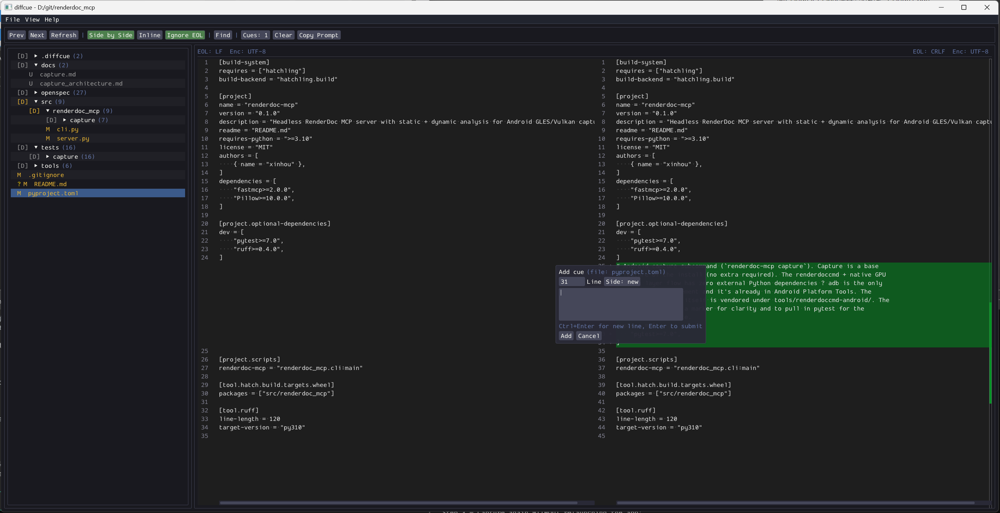

# diffcue

A lightweight, cross-platform diff reviewer for AI coding CLI review loops.



## Why

When using AI coding CLIs (Claude Code, Cursor agents, etc.) in a "vibe" loop,
the user accepts or iterates on changes by reading diffs in the terminal —
which is slow, hides context (line endings, encoding, surrounding code), and
forces the user to manually re-type file paths + line numbers when they want
to give follow-up feedback. **diffcue closes the loop**: review diff → annotate
lines → emit a structured follow-up prompt back to the CLI.

## Usage

```
diffcue [<folder>]
diffcue --help
diffcue --version
```

- `diffcue <folder>` opens a git working tree for review.
- `diffcue` (no args) uses the current working directory.
- `--help` / `-h` prints usage. `--version` / `-V` prints the version.
- Drag-and-drop a folder onto the window to switch.
- `Ctrl+O` opens a native folder picker. `Ctrl+Q` quits. `Ctrl+F` toggles find.

`git` must be on `PATH` at runtime. diffcue invokes `git status` and
`git show` as subprocesses — no libgit2.

## Build

**Prerequisites:** CMake 3.20+, a C++17 compiler (MSVC 2022, Clang 14+, or GCC 11+), and `git` on PATH.

### Clone with submodules

```bash
git clone --recursive https://github.com/user/diffcue.git
```

If you already cloned without `--recursive`:

```bash
git submodule update --init --recursive
```

### Build

```bash
cmake -S . -B build
cmake --build build --config Release
```

The resulting `diffcue` (or `diffcue.exe`) is self-contained: all third-party
libraries are statically linked. Only the OS runtime and OpenGL driver remain
dynamic.

**Platform notes:**
- **Windows (MSVC):** links `/MT` (static CRT). Open `build/diffcue.sln` in
  Visual Studio or build from CLI as above.
- **macOS:** links Cocoa/OpenGL/IOKit frameworks. GLFW is built from the
  vendored submodule — no Homebrew glfw3 needed.
- **Linux:** links `libGL` + X11/Wayland. Verify with `ldd build/diffcue`.

**Build options:**
- `DIFFCUE_BUILD_TESTS=ON` (default) — builds the Catch2 test suite.
- `DIFFCUE_SANITIZE=ON` — enables ASan + UBSan.

**Run tests:**
```bash
cmake --build build --target diffcue_tests --config Release
ctest --test-dir build -C Release --output-on-failure
```

### Submodule management

Submodules are pinned to specific commits. To update a submodule to a newer
version:

```bash
cd thirdparty/<lib>
git checkout <tag-or-branch>
cd ../..
git add thirdparty/<lib>
git commit -m "update <lib> to <version>"
```

Other contributors get the update automatically via `git submodule update`
after pulling.

## `.diffcue/` sidecar files

diffcue creates a `.diffcue/` folder inside the reviewed working tree to
persist review state across sessions. These files are gitignored.

### `cues.json`

```json
{
  "version": 1,
  "folder": "/abs/path/to/repo",
  "cues": [
    {
      "file": "src/main.cpp",
      "side": "new",
      "line": 42,
      "text": "this is wrong, rename to foo",
      "created": 1783000000
    }
  ]
}
```

- `version` — schema version (currently 1). diffcue refuses to load a file
  with a higher version (see design R5).
- `folder` — the absolute path the cues were created against.
- `cues[].side` — `"old"` or `"new"` (which side of the diff the cue is on).
- `cues[].line` — 1-based line number.
- `cues[].created` — Unix epoch seconds.

### `prefs.json`

```json
{
  "version": 1,
  "app_theme": "Dracula",
  "editor_palette": "Dark",
  "diff_mode": "side"
}
```

- `app_theme` — one of the theme names from `View → App Theme`.
- `editor_palette` — `"Dark"`, `"Light"`, or `"Mariana"`.
- `diff_mode` — `"side"` (side by side) or `"inline"` (unified).

## Prompt format

The "Copy Prompt" button builds:

```
- path/to/file.cpp:42 - this is wrong, rename to foo
- path/to/other.h:7 - missing include guard
```

Cues are grouped by file and sorted by line ascending. Stale cues (whose
target line disappeared after an external edit) are marked `[stale: line no
longer exists]`. You can trim or reword the prompt in the prompt pane before
copying — the clipboard tracks the pane's final contents.

## Project layout

```
src/           application source (cli, platform, git, model, ui, app)
thirdparty/    git submodules (imgui, ImGuiColorTextEdit, glfw, Catch2, nfd)
               + our CMakeLists.txt and theme.txt
tests/         Catch2 unit + integration tests
openspec/      spec-driven change history
cmake/         DiffcueDeps.cmake, extract_themes.cmake
```

## Thanks

diffcue is built on the following open-source projects:

- [Dear ImGui](https://github.com/ocornut/imgui) — immediate-mode GUI
- [ImGuiColorTextEdit](https://github.com/goossens/ImGuiColorTextEdit) — syntax-highlighted text editor + diff widget (fork with TextDiff)
- [GLFW](https://github.com/glfw/glfw) — cross-platform windowing (pinned to 3.4)
- [Catch2](https://github.com/catchorg/Catch2) — test framework
- [nativefiledialog-extended](https://github.com/btzy/nativefiledialog-extended) — native folder picker
- [dtl](https://github.com/cubicdaiya/dtl) — diff template library (bundled with ImGuiColorTextEdit)
- [ImGui Theme](https://github.com/ocornut/imgui/issues/707#issuecomment-4107169777) - TheAncientOwl's theme collection
